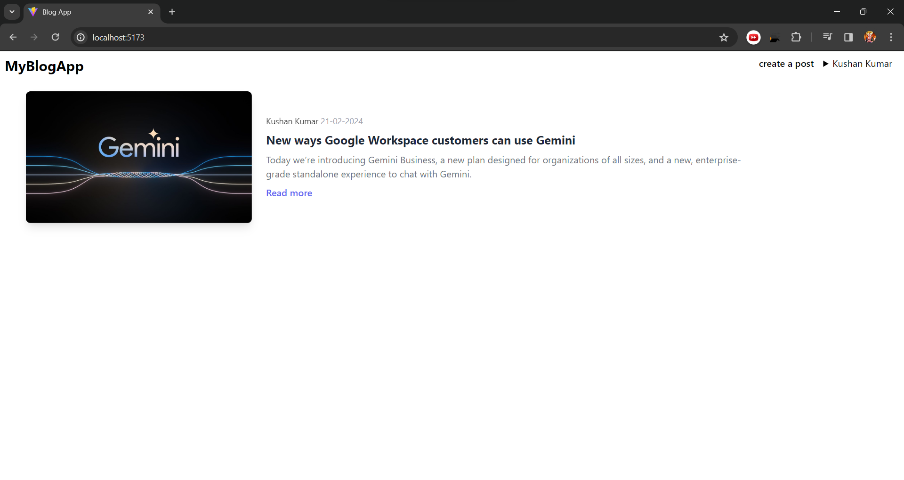
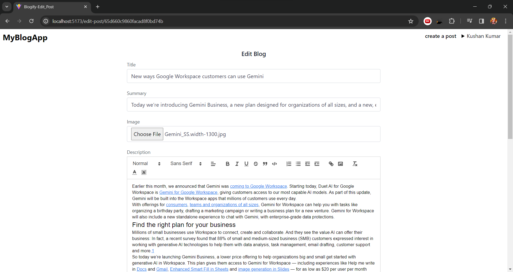
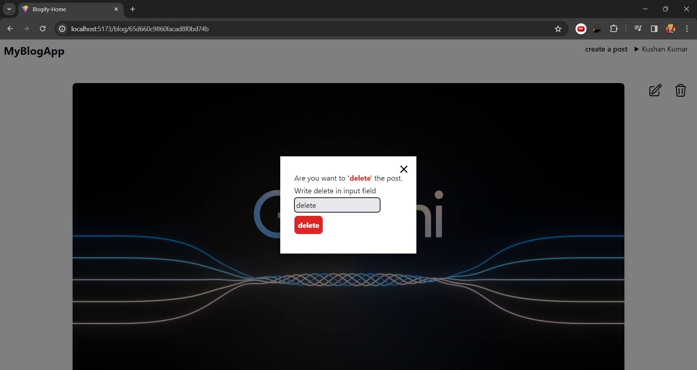
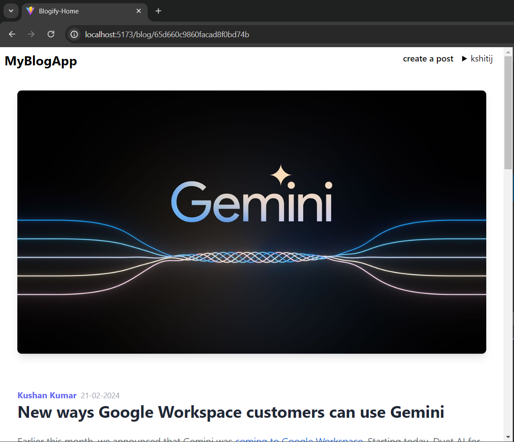
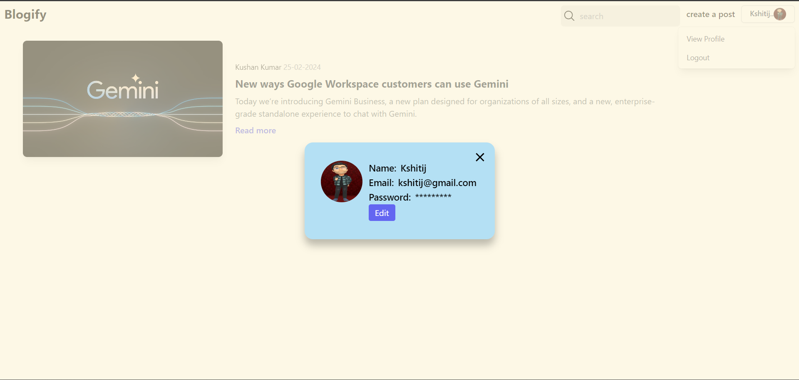
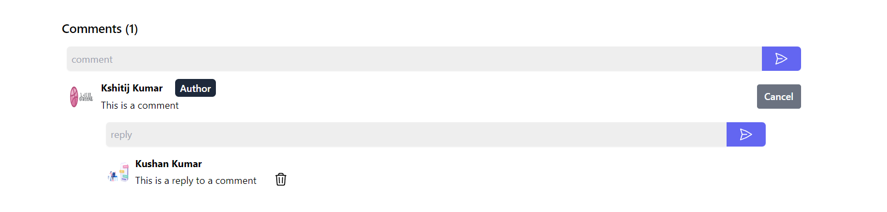
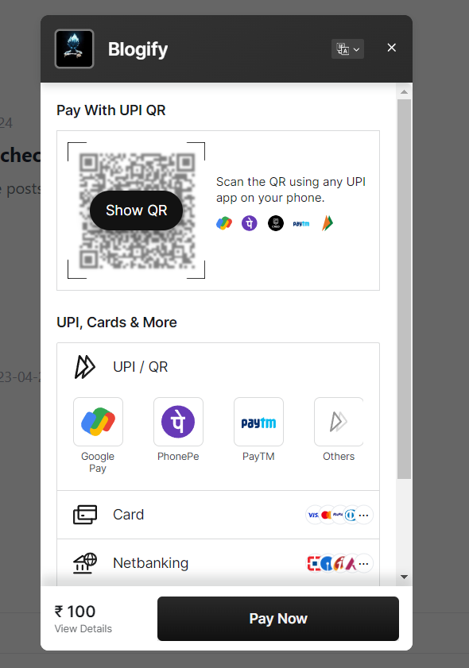
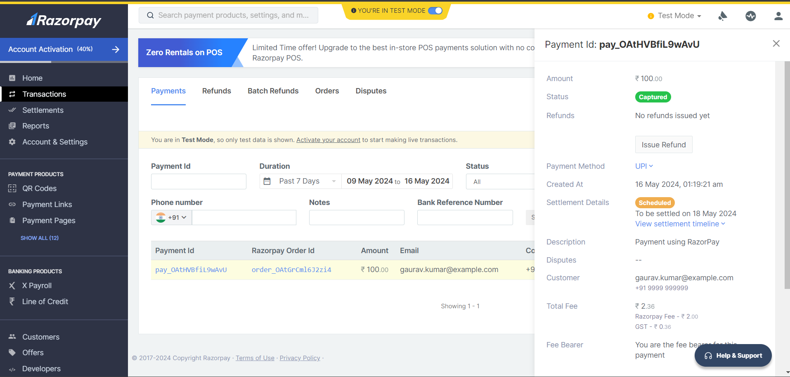

# Blog App

Welcome to the Blog App!

This is a full-stack web application built using the MERN stack (MongoDB, Express.js, React.js, Node.js).

## Clone the repository

```bash
git clone https://github.com/kumarkshitij171/BlogApp.git
```

## Frontend

### Installation

1. Navigate to the `frontend` folder.
2. Run `npm install` to install dependencies.

cmd

```bash
cd frontend
npm install
```

### Configuration

Update the `.env.sample` file with `.env` in the `frontend` folder with your API key.

### Usage

To start the React app, run:

```bash
npm run dev
```

The app will be running at `http://localhost:5173`

## Backend

### Installation

1. Navigate to the `backend` folder.
2. Run `npm install` to install dependencies.

#### cmd

```bash
cd backend
npm install
```

### Configuration

Update the `.env.sample` file with `.env` in the `backend` folder with your API key.

- for Google Oauth, create a project in Google Cloud Console and get the client id and secret and replace the sample adminsdk.json with your own.

### Usage

To start the Node.js server, run:

```bash
npm start
```

The server will be running on port `8080` or Specified Port.

## Features

- **Authentication**: User authentication using JWT tokens.
- **Edit Profile**: Users can edit their profile information.
- **CRUD Operations**: Create, Read, Update, and Delete blog posts.
- **Responsive Design**: Mobile-friendly user interface.

## Technologies Used

- **Frontend**:
  - React.js
  - React Context (for state management)
  - React Router (for routing)
  - fetch (for HTTP requests)
  - Tailwind (for styling)
  - Yup (for form validation)
  - React Quill (for rich text editing)
- **Backend**:
  - Node.js
  - Express.js
  - MongoDB (with Mongoose for ORM)
  - JSON Web Tokens (JWT) for authentication
  - Bcrypt (for password hashing)
  - Multer (for file uploads)
  - Cloudinary (for image uploads)
  - Sharp (for image resizing)
  - Oauth (for Google authentication)
  - Razorpay (for payment gateway)

## Contributing

Contributions are welcome! Please feel free to submit pull requests.

### Screenshots

- Home Page



- Create/Edit Post



- Delete Post



- Only Author have only edit and delete functionality



- User can view and update their profile



- Comment and Reply on post



- Implement payment gateway using Razorpay





<br>

### Deployed on Azure using Docker container

[Click Here!](https://github.com/kumarkshitij171/BlogApp/tree/Deployment)
