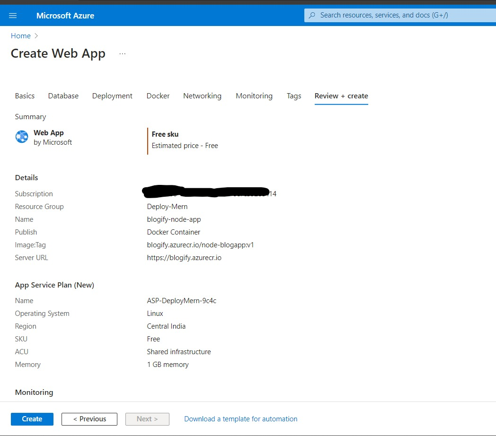
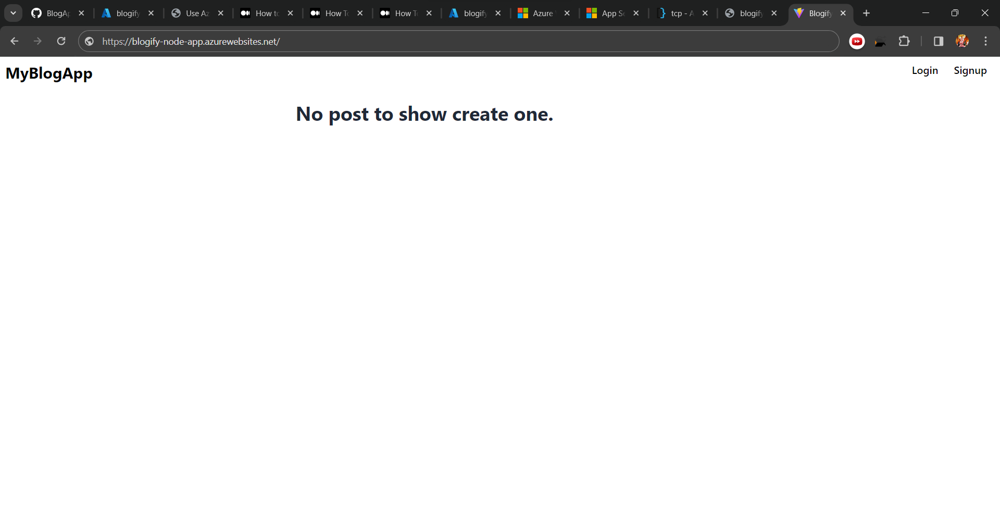

# Deploying MERN App with Docker on Azure Web App

## Overview
This guide will walk you through the steps to deploy a MERN (MongoDB, Express.js, React.js, Node.js) application using Docker and host it on Azure Web App. In this setup, we'll ensure the application listens on the port specified by the Azure Web App environment variable `WEBSITE_PORT`.

## Prerequisites
- Docker installed on your local machine
- An Azure account
- Azure CLI installed on your local machine

## Steps

### 1. Dockerize your MERN application
- Ensure your MERN application is Dockerized. This typically involves creating a `Dockerfile` to specify the environment and dependencies needed to run your application.

### 2. Build Docker image
- Build your Docker image using the `docker build` command. Make sure your Dockerfile is configured to expose the port your application listens on.

```bash
docker build -t your-image-name .
```

### 3. Test the Docker container locally
- Run your Docker container locally to ensure it's working as expected.

```bash
docker run -p 8080:8080 your-image-name
```

### 4. Push Docker image to Azure Container Registry (ACR)
- Push your Docker image to Azure Container Registry using the `az acr build` command.

```bash
az acr build --registry your-acr-name --image your-image-name .
```

### 5. Create Azure Web App
- Create an Azure Web App using the Azure CLI or Azure Portal.

```bash
az webapp create --name your-web-app-name --resource-group your-resource-group --plan your-app-service-plan --runtime "NODE|14-lts"
```

### 6. Configure Azure Web App settings
- Set the `WEBSITE_PORT` environment variable to `8080` using the Azure CLI or Azure Portal.

```bash
az webapp config appsettings set --name your-web-app-name --resource-group your-resource-group --settings WEBSITE_PORT=8080
```

### 7. Deploy Docker image to Azure Web App
- Deploy your Docker image to Azure Web App using Azure CLI.

```bash
az webapp config container set --name your-web-app-name --resource-group your-resource-group --docker-custom-image-name your-acr-name.azurecr.io/your-image-name:latest --docker-registry-server-url https://your-acr-name.azurecr.io
```

### 8. Access your deployed MERN application
- Once the deployment is successful, your MERN application should be accessible at `https://your-web-app-name.azurewebsites.net`.

## Conclusion
Congratulations! You have successfully deployed your MERN application using Docker and hosted it on Azure Web App. You can now access and share your application with others.

---
## Screenshots





